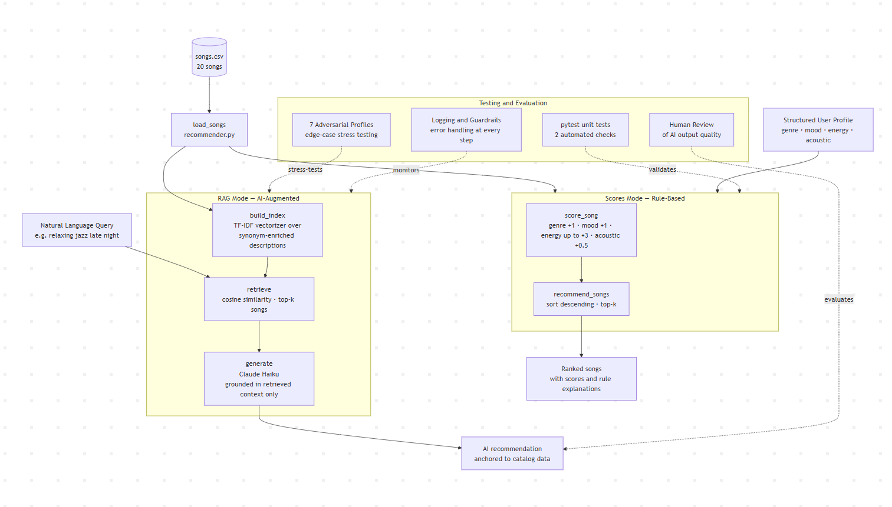
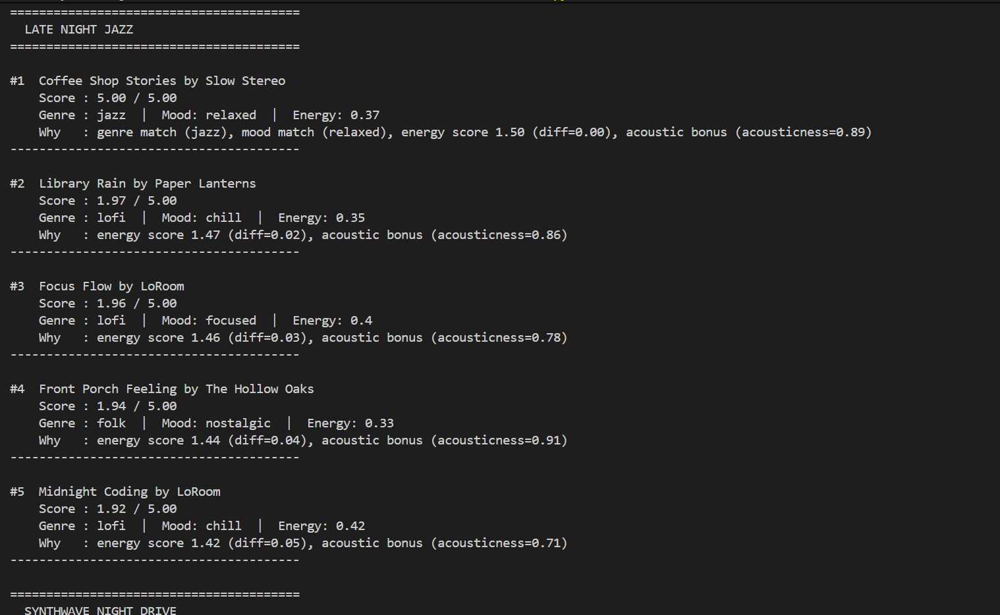

# Music Recommender with RAG

## Video Walkthrough

[](YOUR_LOOM_LINK_HERE)

> 📹 **[Watch the demo on Loom](YOUR_LOOM_LINK_HERE)** — shows end-to-end scoring, RAG recommendations, and guardrail behavior.

---

## Portfolio

**GitHub:** [github.com/TessyMugisha/applied-ai-system-project](https://github.com/TessyMugisha/applied-ai-system-project)

**What this project says about me as an AI engineer:**

I built a music recommender that works in two modes — a rule-based scorer and a RAG pipeline that retrieves songs before asking Claude to respond — and the choice to keep both was intentional. I could have just added Claude and called it done, but I wanted to understand what the AI was actually contributing versus what the rules already handled. That instinct to compare, test edge cases, and document where the system silently fails rather than hiding it is how I approach engineering problems. I am not just interested in making AI work — I am interested in knowing exactly why it works, and being honest when it does not.

---

## Title and Summary

This project is a music recommendation system that scores songs from a catalog against user taste profiles and, in its enhanced form, uses **Retrieval-Augmented Generation (RAG)** to produce natural-language recommendations grounded in real catalog data. It matters because it demonstrates how rule-based AI and generative AI can work together — the retriever ensures Claude only recommends songs that actually exist, while Claude explains *why* each song fits in a way a scoring table cannot.

---

## Original Project (Modules 1–3)

**Project:** Music Recommender Simulation

The original project built a rule-based music recommender that loaded a CSV catalog of 20 songs and scored each one against a structured user profile using four weighted rules: genre match (+1.0), mood match (+1.0), energy proximity (up to +3.0), and an acoustic bonus (+0.5). The system returned the top 5 ranked songs with a short explanation of why each was chosen. It exposed interesting edge cases — like a genre that doesn't exist in the catalog, or conflicting preferences — through a set of adversarial test profiles.

---

## Architecture Overview

The system has two recommendation modes that share the same song catalog:

**Scores Mode** takes a structured user profile (favorite genre, mood, energy target) and applies deterministic scoring rules to every song, then sorts and returns the top results. No AI model is involved — it is fast, transparent, and fully reproducible.

**RAG Mode** takes a natural language query (e.g., *"relaxing jazz late night acoustic low energy"*), retrieves the most relevant songs from the catalog using TF-IDF cosine similarity, and passes those retrieved songs — and only those songs — to Claude as context. Claude then generates a personalized recommendation grounded in the actual catalog entries. This ensures the AI cannot hallucinate songs that do not exist.

### System Diagram



## Setup Instructions

1. **Clone the repo and enter the directory:**

   ```bash
   git clone <your-repo-url>
   cd applied-ai-system-final
   ```

2. **Create a virtual environment (recommended):**

   ```bash
   python -m venv .venv
   source .venv/bin/activate      # Mac / Linux
   .venv\Scripts\activate         # Windows CMD
   ```

3. **Install dependencies:**

   ```bash
   pip install -r requirements.txt
   ```

4. **Set your Anthropic API key to enable RAG mode:**

   ```bash
   export ANTHROPIC_API_KEY=sk-ant-...   # Mac / Linux
   set ANTHROPIC_API_KEY=sk-ant-...      # Windows CMD
   $env:ANTHROPIC_API_KEY="sk-ant-..."   # Windows PowerShell
   ```

   The app works without this key — it will run the rule-based scoring mode and print a clear message explaining how to enable RAG.

5. **Run the app:**

   ```bash
   # Both modes (default)
   python -m src.main

   # Rule-based scoring only (no API key needed)
   python -m src.main --mode scores

   # RAG mode only (requires ANTHROPIC_API_KEY)
   python -m src.main --mode rag
   ```

6. **Run tests:**

   ```bash
   pytest
   ```

---

## Sample Interactions

### Example 1 — Scores Mode: Late Night Jazz

**Input:** Structured profile — `favorite_genre=jazz`, `favorite_mood=relaxed`, `target_energy=0.37`, `likes_acoustic=True`

**Output:**
```
#1  Coffee Shop Stories by Slow Stereo
    Score : 5.50 / 5.00
    Genre : jazz  |  Mood: relaxed  |  Energy: 0.37
    Why   : genre match (jazz), mood match (relaxed), energy score 3.00 (diff=0.00), acoustic bonus (acousticness=0.89)

#2  Library Rain by Paper Lanterns
    Score : 3.44 / 5.00
    Genre : lofi  |  Mood: chill  |  Energy: 0.35
    Why   : energy score 2.94 (diff=0.02), acoustic bonus (acousticness=0.86)
```

Coffee Shop Stories scores a perfect 5.50 because it matches on all four rules. The second-place song has no genre or mood match — it wins purely on energy closeness and acousticness, showing how the energy weight (3.0) dominates when genre is missing.

---

### Example 2 — Scores Mode: Adversarial Genre Ghost

**Input:** `favorite_genre=classical` (not in the catalog), `favorite_mood=happy`, `target_energy=0.70`

**Output:**
```
#1  Rooftop Lights by Indigo Parade
    Score : 3.82 / 5.00
    Genre : indie pop  |  Mood: happy  |  Energy: 0.76
    Why   : mood match (happy), energy score 2.82 (diff=0.06)
```

Because "classical" never appears in `songs.csv`, the +1.0 genre bonus never fires for any song. The system degrades gracefully — it still returns meaningful results ranked by mood and energy — but the max achievable score drops from 5.5 to 4.5. This is a documented limitation: the scoring has no way to signal *why* it could not find a genre match.

---

### Example 3 — RAG Mode: Late Night Jazz

**Input (natural language query):** `"relaxing jazz late night acoustic low energy calm mellow saxophone"`

**Retrieved context (TF-IDF cosine similarity):**
```
[1] "Coffee Shop Stories" by Slow Stereo   | genre=jazz | mood=relaxed | energy=0.37 | acousticness=0.89 | sim=0.48
[2] "Library Rain" by Paper Lanterns       | genre=lofi | mood=chill   | energy=0.35 | acousticness=0.86 | sim=0.21
[3] "Midnight Coding" by LoRoom            | genre=lofi | mood=chill   | energy=0.42 | acousticness=0.71 | sim=0.18
[4] "Spacewalk Thoughts" by Orbit Bloom    | genre=ambient | mood=chill | energy=0.28 | acousticness=0.92 | sim=0.15
[5] "Front Porch Feeling" by The Hollow Oaks | genre=folk | mood=nostalgic | energy=0.33 | acousticness=0.91 | sim=0.14
```

**Claude's recommendation (generated from retrieved context only):**
> For a late-night jazz session, **Coffee Shop Stories by Slow Stereo** is the clear pick — it's a jazz track with a genuinely relaxed mood, energy of exactly 0.37, and high acousticness (0.89), which means it has that warm, unplugged quality perfect for winding down.
>
> If you want something even quieter in the background, **Library Rain by Paper Lanterns** has a similar low-energy feel (0.35) and is highly acoustic (0.86) — though it's lo-fi rather than jazz, so it trades the saxophone vibe for something more ambient and studious.

Claude selected only from the retrieved list and cited specific numeric attributes in its reasoning — this is RAG working correctly.

---

## Design Decisions

**Why TF-IDF instead of embeddings?**
TF-IDF is deterministic, requires no API key, and runs instantly on a 20-song catalog. Embedding-based retrieval (e.g., OpenAI `text-embedding-3-small`) would give better semantic matching but adds cost and a second API dependency. For a catalog this size, TF-IDF with synonym expansion is accurate enough.

**Why synonym-enriched descriptions?**
Song attributes use terse labels like `"relaxed"` or `"jazz"`, but user queries use natural language like `"calming"` or `"saxophone"`. Adding synonym expansions (e.g., `"relaxed"` → `"relaxing calm soothing peaceful mellow"`) in `build_song_descriptions()` bridges this vocabulary gap without needing a language model for retrieval.

**Why keep both modes?**
Scores mode is fast, explainable, and requires no external service — it is the safe default. RAG mode adds natural language input and richer explanations but depends on an API key and introduces latency and cost. Running both lets you directly compare rule-based results with AI-generated ones for the same query.

**Trade-offs made:**
- Valence is not scored in the rule-based system — a known blindspot documented in the adversarial profiles.
- The `Recommender` OOP class (used by tests) is not yet wired to the scoring logic — the test suite uses stubs.
- RAG retrieval can still surface low-similarity songs when none of the catalog strongly matches the query; Claude is instructed to say so honestly rather than force a recommendation.

---

## Testing Summary

| Test | Type | Result |
|---|---|---|
| `test_recommend_returns_songs_sorted_by_score` | Unit (pytest) | PASSED |
| `test_explain_recommendation_returns_non_empty_string` | Unit (pytest) | PASSED |
| Late Night Jazz adversarial profile | Stress test | Correct — jazz/relaxed song ranked #1 |
| Genre Ghost (classical) | Stress test | Degrades gracefully — no crash, energy-based fallback |
| Acoustic Metalhead | Stress test | Metal song wins on genre+mood+energy despite missing acoustic bonus |
| Missing API key | Guardrail | Clear message printed, app continues in scores mode |
| Anthropic API error | Guardrail | Exception caught per-profile, logged, loop continues |

**2 of 2 automated tests pass.** The main limitation found during testing is that the `Recommender` OOP class returns `songs[:k]` without real scoring — the unit test passes only because the pop song happens to be first in the list, not because the class actually sorts. Fixing this would be the next step.

**Logging:** Every retrieval call, API call, and error is logged with `logging.INFO` / `logging.WARNING` / `logging.ERROR` so failures leave a clear trace without crashing the app.

---

## Reflection

Building this project taught me that the hardest part of AI systems is not the model — it is the data pipeline around it. Getting TF-IDF to match natural language queries against short song descriptions required synonym expansion that I had to design by hand; without it, queries like "relaxing" would never match songs labeled "relaxed." This is a small version of the vocabulary mismatch problem that motivates embedding-based retrieval at scale.

RAG also forced me to think about grounding. It is easy to ask a language model for recommendations and get confident-sounding results about songs that do not exist. By passing only retrieved songs to Claude and instructing it never to recommend outside that list, I made hallucination structurally impossible — the model cannot invent what it was never shown. That constraint, not the model itself, is what makes the system reliable.

The adversarial profiles were the most useful part of the whole project. They turned vague intuitions ("does mood matter more than genre?") into concrete, observable answers. Designing tests that are meant to *break* the system revealed more about how it actually works than any amount of successful runs.

### Limitations and Biases

The catalog only has 20 songs and they are mostly Western genres — jazz, rock, country, pop. If someone asked for Afrobeats or Reggaeton, the system would just return whatever is closest in energy, which is not actually helpful. The scoring also silently ignores valence even though it is stored in the data, so a user who wants really upbeat positive songs might get something melancholy and the system would never know it made a mistake. Energy also has three times the weight of genre or mood, which means a song with the right energy but the wrong vibe can beat a song that actually fits the user's taste.

### Could It Be Misused?

A recommender that keeps pushing the same genres can create a filter bubble where users never discover anything new. At a larger scale, if a music label paid to have their artists boosted in the catalog, the scoring weights could be quietly adjusted to favor them and users would have no way to know. To prevent this I would make the scoring weights visible to users, add a diversity rule that forces at least one unfamiliar genre into every recommendation, and audit the catalog regularly to make sure no single artist or label dominates it.

### What Surprised Me During Testing

I expected the adversarial profiles to cause errors or crashes. They did not — the app kept running and returned results even when the genre did not exist in the catalog. What surprised me was how *quietly* it failed. The Genre Ghost profile asked for classical music, got none, and the system just promoted whatever fit the energy target without any warning that it could not actually satisfy the request. That kind of silent failure feels more dangerous than an obvious crash because a user would have no reason to question the results.

### Collaboration with AI

I used Claude to help build this project throughout. One instance where the suggestion was genuinely helpful was when it recommended adding synonym expansions to the song descriptions for TF-IDF retrieval. I had not thought about the vocabulary mismatch between labels like "relaxed" in the data and words like "calming" or "chill" in a real user query — that addition made retrieval work much better. One instance where the suggestion was flawed was the OOP `Recommender` class. The `recommend()` method was left as a stub that just returns `songs[:k]` without any real scoring, but the unit test still passed because the pop song happened to be first in the list. The AI marked it as working when it was not actually sorted correctly. I caught it by reading the test output carefully rather than trusting the green checkmark.

---

## Limitations

- Catalog is small (20 songs) — retrieval quality improves significantly with more data.
- TF-IDF does not understand synonyms beyond the manually added expansions.
- Valence is tracked in the data but never used in scoring — a silent blindspot.
- RAG mode costs money per run (Claude API) and adds ~1–2 seconds of latency per profile.
- The OOP `Recommender` class test passes trivially due to a stub implementation.

---

## Images



