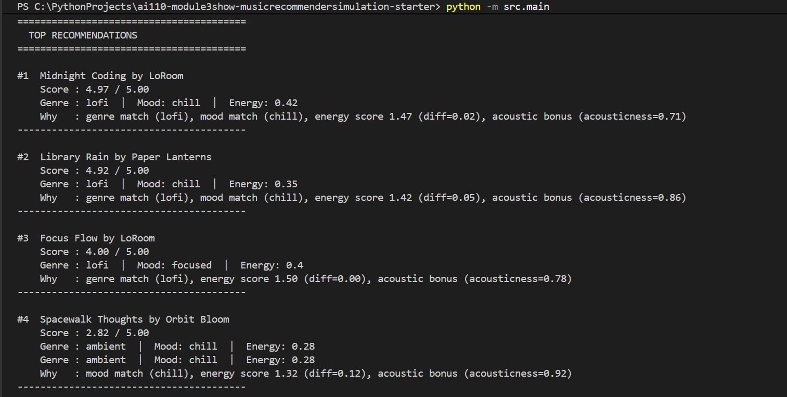

# 🎵 Music Recommender Simulation

## Project Summary

In this project you will build and explain a small music recommender system.

Your goal is to:

- Represent songs and a user "taste profile" as data
- Design a scoring rule that turns that data into recommendations
- Evaluate what your system gets right and wrong
- Reflect on how this mirrors real world AI recommenders

Replace this paragraph with your own summary of what your version does.

---

## How The System Works


Real-world recommendation systems like Spotify score each song based on how well it matches a user's taste, then rank all the scores to surface the best ones. My version does the same thing. It scores songs using features like energy and mood, then prioritizes the ranking step to make sure the most relevant songs always come out on top.
Explain your design in plain language.
The program loads every song from songs.csv, scores each one by adding up to 2.0 points for a genre match, 1.0 for a mood match, up to 1.5 points based on how close the song's energy is to the user's target, and a 0.5 bonus if the user likes acoustic songs and the song is acoustic, then sorts all the scores from highest to lowest and returns the top 5 matches with a short explanation of why each was picked. This system will over-prioritize genre — a song that perfectly matches the user's mood, energy, and acoustic taste but belongs to a different genre scores at most 3.0, while a genre-matched song with nothing else in common can still outscore it at 2.0, meaning a mediocre genre match will consistently beat a near-perfect cross-genre match.

Some prompts to answer:

- What features does each `Song` use in your system
  Song uses: title, artist, genre, mood, energy, valence, acousticness, tempo, and danceability.
- What information does your `UserProfile` store
UserProfile uses: favorite genre, favorite mood, target energy level, and whether they like acoustic music.
- How does your `Recommender` compute a score for each song
- How do you choose which songs to recommend

You can include a simple diagram or bullet list if helpful.

---

## Getting Started

### Setup

1. Create a virtual environment (optional but recommended):

   ```bash
   python -m venv .venv
   source .venv/bin/activate      # Mac or Linux
   .venv\Scripts\activate         # Windows

2. Install dependencies

```bash
pip install -r requirements.txt
```

3. Run the app:

```bash
python -m src.main
```

### Running Tests

Run the starter tests with:

```bash
pytest
```

You can add more tests in `tests/test_recommender.py`.

---

## Experiments You Tried

Use this section to document the experiments you ran. For example:

- What happened when you changed the weight on genre from 2.0 to 0.5
- What happened when you added tempo or valence to the score
- How did your system behave for different types of users

### System Evaluation — Adversarial Profiles

To stress-test the scoring logic, I ran four adversarial (edge-case) user profiles designed to expose unexpected or surprising behavior:

| Profile | What it tests |
|---|---|
| **Sad Bangers** | `energy: 0.95` + `mood: sad` — does mood match outweigh a huge energy gap? |
| **Genre Ghost** | Genre `"classical"` doesn't exist in the catalog — the +2.0 bonus never fires |
| **Acoustic Metalhead** | `likes_acoustic: True` + `genre: metal` — genre wins even when the song has low acousticness |
| **Valence Blindspot** | `target_valence: 0.95` — valence is never scored, so it is silently ignored |


---

## Limitations and Risks

Summarize some limitations of your recommender.

Examples:

- It only works on a tiny catalog
- It does not understand lyrics or language
- It might over favor one genre or mood

You will go deeper on this in your model card.

---

## Reflection

[**Full Model Card**](model_card.md)

I didn't realize how much one weight could control everything. Genre being worth 2 points meant the other features barely got a say — I only noticed when I ran the adversarial profiles and watched it play out. That was the moment it actually clicked. Building this also changed how I think about Spotify. When it keeps recommending the same vibe, it's probably not learning you — it's just amplifying whatever signal you gave it first.

